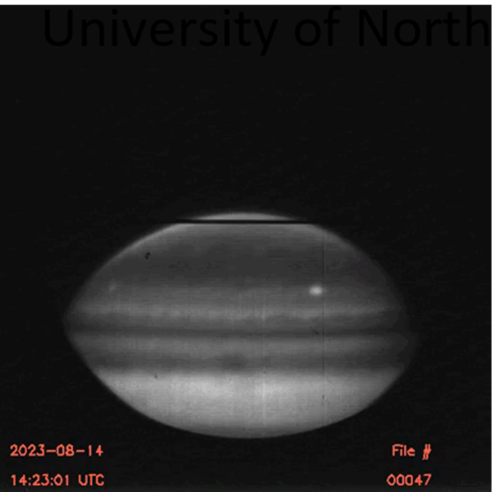

# Traces of Weather in Jupiter's Upper Atmosphere
This repository contains a sample of my work surrounding the investigation of temperature variations in the upper atmosphere of Jupiter.

## Required Libraries: 
All of the libraries used my code are publically accessible, for attempts to replicate my code, you will most likely recieve an error associated with "import h3ppy". To avoid this go to "https://github.com/henrikmelin/h3ppy" and download and import ampere_utlis into your local python environment. 

## Data
All of the work containned in this repository is using data collected from NASA's IRTF telescope, this data was collected over a month period in August 2023, this data was privately sent to me, I have uploaded a sample of this dataset. 

For access to other data from the IRTF telescope visit, https://dataverse.harvard.edu/dataset.xhtml?persistentId=doi:10.7910/DVN/KVQWNJ 

## Project Context

  

This project investigated how the temperature of Jupiter's upper atmosphere varies from the pole to the equator. From previous studies on this topic it was discovered that the equatorial regions of jupiter's upper atmosphere are unexpectedly hot. This project uses fresh data, collected in sequence on a month long period and tests how the temperature of the polar and equatorial regions varies over a short period of time. To calculate the temperature of jupiter's upper atmosphere, you first need to locate H3+ emission lines. Hydrogen 3+ is produced when through a chemical reaction between H_2 (traditional Hydrogen) and incoming electrons. The greater the quantity of H3+ present, the hotter the atmosphere is. 

## Project Conclusions
This project explored the relationship between the polar and equatorial regions of Jupiter's upper atmosphere across the entire observation period. This project found a 39% correlation between the polar and equatorial temperature suggesting a that energy is being transported from the pole down to the equatorial regions.

### Folder's
- Finding H3+ Emission Lines
- Mapping H3+ Emission Lines to H3ppy
- Calculating Temperature and Column Density
- Statisical Analysis

